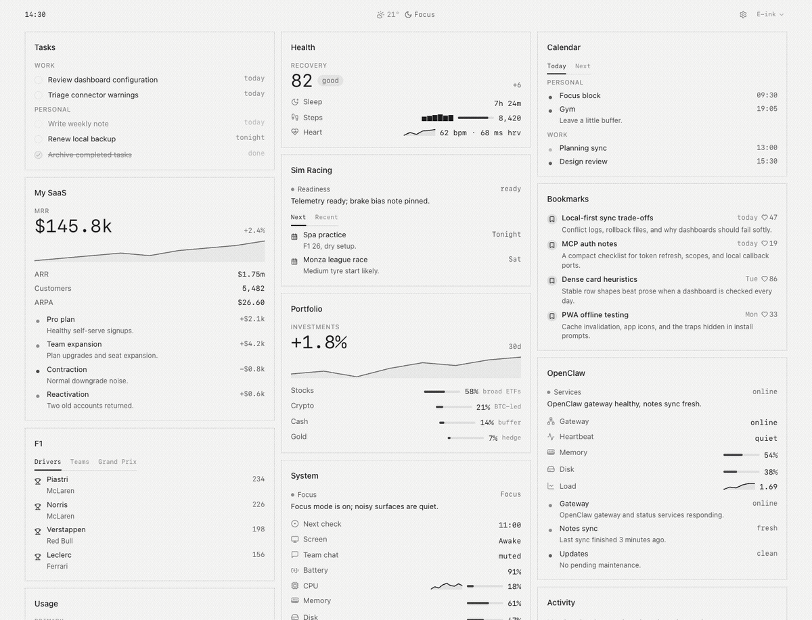

# fab-dashboard

[](https://github.com/linuz90/fab-dashboard/actions/workflows/ci.yml)
[](LICENSE)

**Agent-friendly, local-first personal dashboard.**

Hand this repo to your favorite agent, like [Codex](https://developers.openai.com/codex/cli) or [Claude Code](https://claude.com/claude-code), tell it what you care about, and get a glanceable home screen powered by your own data, apps, and tools.

Think of this as a dashboard engine plus an agent playbook: the agent inspects your current dashboard, suggests relevant cards, picks the right connector for each data source, and wires it up safely. Your real information, API keys, local scripts, snapshots, and cache stay outside this repo — usually in `~/.config/fab-dashboard`.

Ships with several beautiful themes, and you can ask your agent to design more.



## Get Started

Requires [Bun](https://bun.sh) 1.3 or later. Runs on macOS and Linux; background-service templates cover launchd and systemd.

### Build Your Dashboard With An Agent

This repo is designed to be handed to a coding agent. Paste this prompt into [Codex](https://developers.openai.com/codex/cli) or [Claude Code](https://claude.com/claude-code) and let the agent handle setup and interview you:

```txt
Clone https://github.com/linuz90/fab-dashboard.git and set it up, then guide me
through creating a personal dashboard that is relevant to me: ask me questions
about who I am, what I care about, and which apps, tools, and services I use,
then build the dashboard.
```

Already cloned the repo? Run your agent from the project root and skip the clone step:

```txt
Guide me through creating a personal dashboard that is relevant to me: ask me
questions about who I am, what I care about, and which apps, tools, and
services I use, then build the dashboard.
```

Once the first cards exist, keep asking for more in plain language, one at a time:

```txt
Add a tasks card with my to-dos, which are in Things on my Mac.
```

```txt
Add a card that shows my Codex and Claude usage for the day.
```

You can also share a card without exposing its private data or executable connector configuration:

```txt
Prepare my tasks and calendar cards so I can share them with a friend.
```

When creating cards, the agent will:

- inspect your active dashboard with `bun run cli doctor --json`, then read existing cards and connectors so it fits your layout instead of clobbering it
- suggest concrete cards grouped by source: local files/apps, an API with a key, a command/script connector, or a manual/static starter
- choose the connector shape that honestly matches each source: `http`, `file`, `command`, trusted `ts`, or `static`
- wire real data safely: API keys go in `$FAB_DASHBOARD_HOME/.env`, real cards stay in your config home, and private data does not get committed to this engine repo

When sharing, the agent prepares a privacy-safe card pack first, then lets you choose clipboard, a secret GitHub gist, a local file, or another destination.

The interview-then-build flow is described in [docs/bootstrap.md](docs/bootstrap.md). Card creation and sharing live in the bundled [`create-card`](.agents/skills/create-card/SKILL.md) and [`share-card`](.agents/skills/share-card/SKILL.md) skills, while [AGENTS.md](AGENTS.md) carries the shared repo rules that Codex and Claude read automatically.

This is a clone-and-run project by design, not an npm package: you clone the whole engine so your agent has the source, skills, and repo instructions on hand to build and validate cards locally. `package.json` stays `private: true` to prevent accidental publication while the GitHub repository can still be public.

### Try The Demo

Prefer to see it running before involving an agent? Clone the repo and run the safe demo dashboard:

```bash
git clone https://github.com/linuz90/fab-dashboard.git
cd fab-dashboard
bun install
export FAB_DASHBOARD_HOME="$PWD/local/demo"
export FAB_DASHBOARD_STATE_HOME="$PWD/local/state"
bun run cli init --demo --force
bun run dev
```

Open the Vite URL printed by `bun run dev` (normally `http://127.0.0.1:5193`).

The demo uses safe static fixtures and starts in the `e-ink` theme. Some entries use public, recognizable references so the cards feel concrete, but they do not contain private account data, secrets, or personal snapshots.

### Serve It Privately And Install It

fab-dashboard is meant to become a small personal home screen you can open from any device. After your real dashboard exists, ask an agent to help you run it as a background service, expose it privately with [Tailscale Serve](https://tailscale.com/docs/features/tailscale-serve), and install the HTTPS tailnet URL as a PWA on your phone or tablet:

```txt
Help me run fab-dashboard as a background service, expose it privately with Tailscale Serve, and install it as a PWA on my phone.
```

Tailscale is a good default recommendation here: its [Personal plan](https://tailscale.com/pricing) is free for individual/home use, and Serve keeps the dashboard available only to devices and users allowed in your tailnet. Use Tailscale Funnel only if you intentionally want a public internet URL.

For the practical setup and host allow-list details, see [docs/service.md](docs/service.md).

## How It Works

Most dashboards start as one-off code. fab-dashboard keeps the polished interface reusable while letting each user bring their own data through explicit connectors:

- `static` connectors for demos and safe examples
- `http` connectors for JSON APIs
- `file` connectors for exported JSON snapshots
- `command` connectors for local scripts that print JSON
- trusted `ts` connectors for local normalization or multi-source reads

Cards stay declarative. Connectors own data access. Broken sources are scoped to the affected card instead of blanking the whole dashboard.

## Use Your Own Data

You can author dashboard files by hand, but the intended path is to let an agent create and validate them for you from the project root.

```txt
~/.config/fab-dashboard/
  README.md
  dashboard.json
  cards/<type>/card.json
  connectors/<id>/connector.json
  .env

~/.local/state/fab-dashboard/
  cache/
  history.json
```

Put API keys in `$FAB_DASHBOARD_HOME/.env` and reference them from connectors as `env:NAME`. Use `file:/absolute/path` for secrets stored in separate local files. Never commit real dashboards, private command scripts, personal snapshots, connector cache, or secret material.

Use `$FAB_DASHBOARD_HOME/README.md` as the private operating note for your dashboard: service manager, local URL, Tailscale URL, restart command, companion local APIs, and refresh jobs. `bun run cli init` creates a starter file, and `bun run cli doctor --json` reports whether it exists. Agents should read and update it when they change how the dashboard runs.

To use a different config home:

```bash
FAB_DASHBOARD_HOME="$PWD/local/my-dashboard" \
FAB_DASHBOARD_STATE_HOME="$PWD/local/my-dashboard/.state" \
bun run dev
```

## Cards And Connectors

A dashboard card has two parts:

- `cards/<type>/card.json` describes how the card renders.
- `connectors/<id>/connector.json` describes where data comes from.

For example, a portfolio card can read `portfolio.allocation` and `portfolio.history` from a connector named `portfolio`. The card JSON stays reusable; the connector can later move from a static demo fixture to a file export, local command, or API.

Reusable block primitives include `text`, `metric`, `rows`, `list`, `tabs`, `status`, `allocation`, `leaderboard`, `sparkline`, `group`, `divider`, and `action-row`. See [docs/config.md](docs/config.md) for the schema shape and rendering options.

## Appearance

Themes and layout presets are built-in engine features, not arbitrary user CSS. Dashboards can choose the enabled theme list, theme order, maximum shell width, and maximum masonry columns:

```json
{
  "appearance": {
    "defaultTheme": "e-ink",
    "themes": ["e-ink", "basic", "apple", "classic-macos", "kingdom", "live"],
    "layout": {
      "width": "extra-large",
      "maxColumns": 4
    }
  }
}
```

Layout width presets are `small`, `medium`, `large`, and `extra-large`; `large` preserves the default 1400px shell. `maxColumns` accepts `1` through `4` and is a cap, so narrow screens still collapse naturally.

Themes can also use generic runtime signals like `data-time-phase` and `data-local-hour` for clock-aware variants. See [docs/themes.md](docs/themes.md) for adding, disabling, reordering, and authoring themes.

## Commands

```bash
bun run dev          # starts at API :7893 + Vite :5193; advances if busy
bun run start        # serve built app + API on :7893
bun run build
bun run typecheck
bun run test
bun run create-demo-gif # regenerate docs/assets/fab-dashboard-demo.gif

bun run cli init
bun run cli init --demo
bun run cli validate
bun run cli doctor
bun run cli doctor --json
bun run cli doctor --fetch
bun run cli service print macos
bun run cli service print systemd
```

For a shell-style command during development, run `bun link` from this repo or call `./bin/fab-dashboard`.
See [docs/service.md](docs/service.md) for local service templates, Tailscale Serve notes, and safe exposure guidance.

## Runtime Defaults

```txt
FAB_DASHBOARD_PORT=7893
FAB_DASHBOARD_HOST=127.0.0.1
FAB_DASHBOARD_ALLOWED_HOSTS=localhost,127.0.0.1
FAB_DASHBOARD_PUBLIC_ORIGIN=
FAB_DASHBOARD_TRUSTED_CONFIG_ORIGINS=
```

`FAB_DASHBOARD_PORT` wins over `PORT`. Without either override, `bun run dev` starts at port `7893` and advances to the first available API port; Vite independently starts at `5193` and does the same. Explicit port overrides remain strict. `FAB_DASHBOARD_HOME` and `FAB_DASHBOARD_STATE_HOME` override the default config and state directories. UI writes, such as card reordering and layout changes from settings, are enabled only when the server is bound to a local host. Add exact private proxy origins to `FAB_DASHBOARD_TRUSTED_CONFIG_ORIGINS` only when you intentionally want settings writes through something like Tailscale Serve.

Use `.env.example` as a safe starting point for local development overrides.

## Public Repo Boundary

This repository is the public reusable engine. Contributions should be generic: new block primitives, connector kinds, schema/runtime improvements, themes, tests, docs, templates, and safe examples.

Private dashboards belong in `$FAB_DASHBOARD_HOME`, not in tracked files. If your private card needs a missing primitive or connector behavior, contribute that reusable engine change with a safe example.

## Contributing

Read [CONTRIBUTING.md](CONTRIBUTING.md) before opening a PR and [SECURITY.md](SECURITY.md) before reporting sensitive issues.

Validation for most changes:

```bash
bun run typecheck
bun run test
FAB_DASHBOARD_HOME="$PWD/local/demo" FAB_DASHBOARD_STATE_HOME="$PWD/local/state" bun run cli init --demo --force
FAB_DASHBOARD_HOME="$PWD/local/demo" FAB_DASHBOARD_STATE_HOME="$PWD/local/state" bun run cli validate
```

## License

MIT. See [LICENSE](LICENSE).
